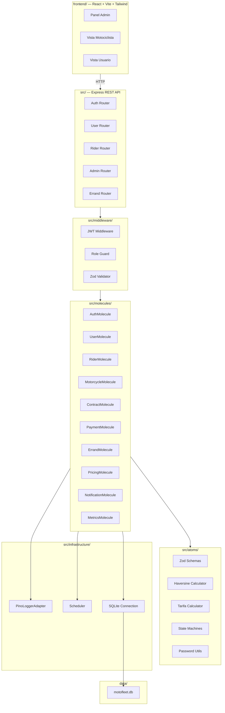
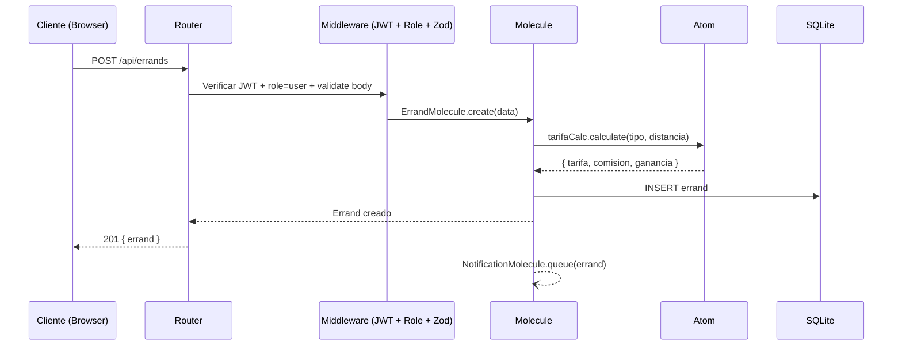
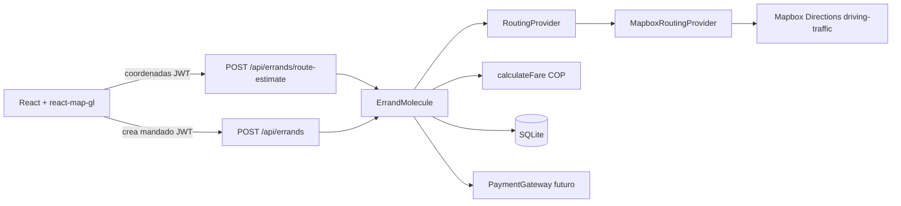

# Documento de Diseño — MotoFleet MVP

## Overview

MotoFleet MVP es un proyecto standalone que implementa una plataforma web para la administración de renta de motocicletas y un marketplace de mandados (transporte de objetos, compras, trámites). El proyecto es completamente independiente — no forma parte de ningún monorepo, no depende de paquetes externos como `@bio/core`, y se despliega de forma autónoma.

### Objetivos de diseño

- **Simplicidad**: Proyecto standalone con dependencias mínimas y directas (npm)
- **Organización clara**: Estructura atoms/molecules como convención organizativa de código
- **API REST**: Express con autenticación JWT y autorización por rol
- **Validación estricta**: Zod en cada boundary (request, response, domain)
- **Testabilidad**: Lógica pura separada de I/O, propiedades verificables con fast-check

### Decisiones técnicas clave

| Decisión                               | Justificación                                                    |
| -------------------------------------- | ---------------------------------------------------------------- |
| Proyecto standalone (no monorepo)      | Deployment independiente, sin dependencias externas              |
| SQLite con better-sqlite3 directo      | Simple, sin ORM, migraciones SQL manuales, archivo único         |
| Express REST API                       | Framework maduro, ecosistema amplio, sin capas MCP               |
| JWT con roles embebidos                | Evita consultas de permisos por request, 24h expiración          |
| Haversine para distancia               | Cálculo offline sin dependencias externas, suficiente para MVP   |
| Email como único canal de notificación | Simple, confiable, escalable post-MVP                            |
| Pagos manuales (sin gateway)           | MVP valida modelo de negocio antes de integrar pasarelas         |
| Coordenadas manuales por dirección     | Sin integración a geocoding API en MVP                           |
| Pino simplificado (sin OpenTelemetry)  | Logging estructurado con pino-pretty en desarrollo               |
| Scheduler propio (setInterval)         | Para expiración de contratos y retry de emails, sin cron externo |
| ILogger interface propia               | Desacopla logging de implementación, permite mocks en tests      |

### Patrones organizativos (inspirados en bio-core, simplificados)

| Patrón                    | Uso en MotoFleet                              | Simplificación                              |
| ------------------------- | --------------------------------------------- | ------------------------------------------- |
| `ILogger` interface       | Desacoplar logging de implementación          | Sin OpenTelemetry, sin hooks, sin log hooks |
| `Scheduler` class         | Batch jobs (contratos vencidos, retry emails) | Misma API básica, sin activity log complejo |
| `IMolecule` interface     | Convención para módulos de negocio            | Solo name/version/initialize?/dispose?      |
| atoms/molecules structure | Organización de código                        | Sin cells, sin organisms, sin MCP           |

---

## Architecture

### Diagrama de alto nivel



### Estructura del proyecto

```
bio-core-motofleet/
├── package.json ← standalone project root
├── tsconfig.json
├── vitest.config.ts
├── .env.example
├── src/
│ ├── index.ts ← Entry point (server startup)
│ ├── app.ts ← Express app setup (middleware, routes)
│ ├── atoms/
│ │ ├── schemas.ts ← Zod schemas (User, Rider, Motorcycle, etc.)
│ │ ├── haversine.ts ← Cálculo de distancia geográfica
│ │ ├── tarifa.ts ← Cálculo de tarifa/comisión/ganancia
│ │ ├── password.ts ← Hash y validación de contraseñas
│ │ └── stateMachines.ts ← Transiciones de estado válidas
│ ├── molecules/
│ │ ├── IMolecule.ts ← Interface ligera (definida localmente)
│ │ ├── AuthMolecule.ts
│ │ ├── UserMolecule.ts
│ │ ├── RiderMolecule.ts
│ │ ├── CosignerMolecule.ts
│ │ ├── MotorcycleMolecule.ts
│ │ ├── ContractMolecule.ts
│ │ ├── PaymentMolecule.ts
│ │ ├── ErrandMolecule.ts
│ │ ├── PricingMolecule.ts
│ │ ├── NotificationMolecule.ts
│ │ └── MetricsMolecule.ts
│ ├── routes/
│ │ ├── auth.routes.ts
│ │ ├── user.routes.ts
│ │ ├── rider.routes.ts
│ │ ├── motorcycle.routes.ts
│ │ ├── contract.routes.ts
│ │ ├── cosigner.routes.ts
│ │ ├── payment.routes.ts
│ │ ├── errand.routes.ts
│ │ ├── pricing.routes.ts
│ │ └── metrics.routes.ts
│ ├── middleware/
│ │ ├── auth.middleware.ts ← JWT verification + user extraction
│ │ ├── roleGuard.middleware.ts ← Role-based access control
│ │ ├── validate.middleware.ts ← Zod schema validation
│ │ └── errorHandler.middleware.ts ← Global error handler
│ ├── infrastructure/
│ │ ├── logger.ts ← ILogger + PinoLoggerAdapter (sin OpenTelemetry)
│ │ ├── scheduler.ts ← Scheduler class para tareas recurrentes
│ │ └── database.ts ← SQLite connection (better-sqlite3 directo)
│ └── migrations/
│ └── 001_initial.sql ← Schema completo
├── frontend/ ← React + Vite + Tailwind (dashboard propio)
│ ├── package.json
│ ├── vite.config.ts
│ ├── tailwind.config.js
│ ├── index.html
│ └── src/
│ ├── App.tsx
│ ├── components/
│ ├── pages/
│ ├── hooks/
│ └── types/
├── tests/
│ ├── atoms/
│ │ ├── haversine.test.ts
│ │ ├── tarifa.test.ts
│ │ ├── stateMachines.test.ts
│ │ ├── password.test.ts
│ │ └── schemas.test.ts
│ ├── molecules/
│ │ ├── auth.test.ts
│ │ ├── errand.test.ts
│ │ └── contract.test.ts
│ └── properties/
│ ├── tarifa.property.test.ts
│ ├── haversine.property.test.ts
│ ├── stateMachines.property.test.ts
│ ├── validation.property.test.ts
│ ├── authorization.property.test.ts
│ ├── pricingRule.property.test.ts
│ └── partialUpdate.property.test.ts
└── data/ ← SQLite database files (runtime, gitignored)
└── .gitkeep
```

### Flujo de una solicitud típica



### Stack tecnológico

| Capa          | Tecnología               | Versión mínima   |
| ------------- | ------------------------ | ---------------- |
| Runtime       | Node.js                  | 20 LTS           |
| Framework     | Express                  | 4.x              |
| Lenguaje      | TypeScript               | 5.x              |
| Base de datos | better-sqlite3           | 11.x             |
| Validación    | Zod                      | 3.x              |
| Auth          | jsonwebtoken + bcrypt    | —                |
| Logging       | Pino + pino-pretty (dev) | 9.x              |
| Email         | nodemailer               | 6.x              |
| Frontend      | React + Vite + Tailwind  | React 18, Vite 5 |
| Testing       | Vitest + fast-check      | Vitest 2.x       |

---

## Components and Interfaces

### Infrastructure (src/infrastructure/)

#### `logger.ts`

```typescript
/**
 * Interfaz de logging desacoplada de la implementación.
 * Permite inyectar mocks en tests sin side-effects.
 * Re-implementada localmente — sin OpenTelemetry, sin hooks.
 */
export interface ILogger {
  info(msg: string, context?: Record<string, unknown>): void;
  warn(msg: string, context?: Record<string, unknown>): void;
  error(msg: string, context?: Record<string, unknown>): void;
  debug(msg: string, context?: Record<string, unknown>): void;
  child(bindings: Record<string, unknown>): ILogger;
}
```

/\*\*

- Adapter que envuelve Pino para satisfacer ILogger.
- Solo Pino con pino-pretty en dev, JSON en producción.
- Sin OpenTelemetry, sin traceId/spanId, sin log hooks.
  \*/
  export class PinoLoggerAdapter implements ILogger {
  constructor(private readonly pino: PinoLike) {}
  // Traduce firma ILogger (msg, context?) a firma Pino (obj?, msg)
  }

/\*_ Factory para crear loggers con nombre de módulo _/
export function createLogger(module: string): ILogger;

````

#### `scheduler.ts`

```typescript
export interface ScheduledTask {
  id: string;
  name: string;
  intervalMs: number;
  action: () => Promise<string | void>;
  enabled: boolean;
  lastRun: number | null;
  nextRun: number;
  runCount: number;
  errors: number;
}

/**
 * Scheduler para tareas recurrentes (expiración de contratos, retry de emails).
 * Usa setInterval con gestión de estado. Sin dependencias externas.
 */
export class Scheduler {
  register(id: string, name: string, intervalMs: number, action: () => Promise<string | void>, startImmediately?: boolean): void;
  unregister(id: string): boolean;
  pause(id: string): boolean;
  resume(id: string): boolean;
  trigger(id: string): Promise<boolean>;
  list(): Array<Omit<ScheduledTask, 'action'>>;
  shutdown(): void;
}
````

#### `database.ts`

```typescript
import Database from "better-sqlite3";

/**
 * Conexión directa a SQLite con better-sqlite3.
 * Sin factory, sin ORM — migraciones SQL manuales.
 * WAL mode habilitado para mejor concurrencia de lectura.
 */
export function createDatabase(dbPath: string): Database.Database;
```

/\*\*

- Ejecuta migraciones SQL desde src/migrations/.
- Lee archivos .sql ordenados numéricamente y los ejecuta en transacción.
  \*/
  export function runMigrations(db: Database.Database, migrationsDir: string): void;

/\*_ Singleton del database para inyectar en molecules _/
export function getDatabase(): Database.Database;
export function closeDatabase(): void;

````

### Atoms (src/atoms/ — funciones puras)

#### `haversine.ts`

```typescript
/**
 * Calcula la distancia en km entre dos puntos geográficos usando Haversine.
 * Retorna un valor con 2 decimales, mínimo 0.5 km.
 */
export function haversineDistance(
  origin: { lat: number; lng: number },
  destination: { lat: number; lng: number },
): number;
````

#### `tarifa.ts`

```typescript
export interface PricingInput {
  tarifaBase: number; // 0.01–999,999.99
  tarifaPorKm: number; // 0.00–9,999.99
  comisionPorcentaje: number; // 1.00–50.00
  distanciaKm: number; // ≥ 0.5
}

export interface PricingResult {
  tarifa: number; // Redondeo half-up a 2 decimales
  comisionPlataforma: number;
  gananciaRider: number;
}

/**
 * Calcula tarifa, comisión y ganancia del rider.
 * Invariante: tarifa = comisionPlataforma + gananciaRider (±0.01 por redondeo)
 * Determinista: mismos inputs → mismo resultado siempre
 */
export function calculateTarifa(input: PricingInput): PricingResult;

/** Redondea un número a N decimales usando half-up. */
export function roundHalfUp(value: number, decimals?: number): number;
```

#### `stateMachines.ts`

```typescript
export type MotorcycleState =
  | "disponible"
  | "rentada"
  | "mantenimiento"
  | "retirada";
export type ContractState = "activo" | "vencido" | "renovado" | "cancelado";
export type ErrandState =
  | "solicitado"
  | "aceptado"
  | "recogido"
  | "entregado"
  | "cancelado";

/** Valida si una transición de estado es válida. */
export function isValidMotorcycleTransition(
  from: MotorcycleState,
  to: MotorcycleState,
  context?: { hasActiveContract?: boolean },
): boolean;

export function isValidContractTransition(
  from: ContractState,
  to: ContractState,
): boolean;
export function isValidErrandTransition(
  from: ErrandState,
  to: ErrandState,
): boolean;

/** Retorna las transiciones válidas desde un estado dado. */
export function getValidMotorcycleTransitions(
  from: MotorcycleState,
  context?: { hasActiveContract?: boolean },
): MotorcycleState[];

export function getValidErrandTransitions(from: ErrandState): ErrandState[];
```

#### `password.ts`

```typescript
/** Genera un hash bcrypt de la contraseña. */
export function hashPassword(plain: string): Promise<string>;

/** Compara contraseña plana con hash almacenado. */
export function verifyPassword(plain: string, hash: string): Promise<boolean>;

/** Valida requisitos: 8-72 chars, ≥1 mayúscula, ≥1 minúscula, ≥1 dígito. */
export function isValidPassword(password: string): boolean;
```

#### `schemas.ts` (Zod)

```typescript
import { z } from 'zod';

export const emailSchema: z.ZodString;
export const phoneSchema: z.ZodString;
export const passwordSchema: z.ZodString;

export const createUserSchema: z.ZodObject<{...}>;
export const createRiderSchema: z.ZodObject<{...}>;
export const createMotorcycleSchema: z.ZodObject<{...}>;
export const createContractSchema: z.ZodObject<{...}>;
export const createPaymentSchema: z.ZodObject<{...}>;
export const createErrandSchema: z.ZodObject<{...}>;
export const createPricingRuleSchema: z.ZodObject<{...}>;
export const createCosignerSchema: z.ZodObject<{...}>;
export const loginSchema: z.ZodObject<{...}>;
```

### Molecules (src/molecules/ — lógica de negocio con I/O)

Cada Molecule sigue la convención `IMolecule` como interfaz organizativa ligera, definida localmente en `src/molecules/IMolecule.ts`:

```typescript
/** Convención ligera para módulos de negocio — NO importada de @bio/core */
export interface IMolecule {
  readonly name: string;
  readonly version: string;
  initialize?(): Promise<void>;
  dispose?(): Promise<void>;
}
```

#### `AuthMolecule`

```typescript
export class AuthMolecule implements IMolecule {
  readonly name = "auth";
  readonly version = "1.0.0";

  constructor(
    private db: Database.Database,
    private logger: ILogger,
  ) {}

  login(
    email: string,
    password: string,
  ): Promise<{ token: string; role: string } | null>;
  verifyToken(token: string): { id: string; role: Role; email: string } | null;
  getFailedAttempts(email: string): number;
  incrementFailedAttempts(email: string): void;
  resetFailedAttempts(email: string): void;
  isAccountLocked(email: string): boolean;
}
```

#### `ErrandMolecule`

```typescript
export class ErrandMolecule implements IMolecule {
  readonly name = "errands";
  readonly version = "1.0.0";

  constructor(
    private db: Database.Database,
    private logger: ILogger,
  ) {}

  create(userId: string, data: CreateErrandInput): Errand;
  accept(errandId: string, riderId: string): Errand;
  markPickedUp(errandId: string, riderId: string): Errand;
  markDelivered(errandId: string, riderId: string): Errand;
  cancel(
    errandId: string,
    actorId: string,
    role: Role,
    reason?: string,
  ): Errand;
  listAvailable(): Errand[];
  listByUser(
    userId: string,
    filters?: ErrandFilters,
    page?: number,
  ): PaginatedResult<Errand>;
  listByRider(
    riderId: string,
    filters?: ErrandFilters,
    page?: number,
  ): PaginatedResult<Errand>;
  getById(errandId: string): Errand | null;
}
```

#### `ContractMolecule`

```typescript
export class ContractMolecule implements IMolecule {
  readonly name = "contracts";
  readonly version = "1.0.0";

  constructor(
    private db: Database.Database,
    private logger: ILogger,
  ) {}

  create(data: CreateContractInput): RentalContract;
  cancel(contractId: string): RentalContract;
  renew(contractId: string, newEndDate: string): RentalContract;
  expireOverdue(): number; // batch job: marca contratos vencidos
  list(filters?: ContractFilters): PaginatedResult<RentalContract>;
  getById(contractId: string): RentalContract | null;
}
```

#### `NotificationMolecule`

```typescript
export class NotificationMolecule implements IMolecule {
  readonly name = "notifications";
  readonly version = "1.0.0";

  constructor(
    private db: Database.Database,
    private logger: ILogger,
    private transporter: nodemailer.Transporter,
  ) {}

  /** Encola notificación. Reintenta hasta 3 veces con intervalos de 30s (vía Scheduler). */
  sendErrandStatusChange(
    errandId: string,
    newStatus: ErrandState,
    reason?: string,
  ): Promise<void>;
  processQueue(): Promise<number>;
}
```

### Middleware (src/middleware/)

#### `auth.middleware.ts`

```typescript
/**
 * Extrae y verifica JWT del header Authorization: Bearer <token>.
 * Inyecta req.user = { id, role, email } en el request.
 * Retorna 401 si token inválido o ausente.
 */
export function authMiddleware(
  req: Request,
  res: Response,
  next: NextFunction,
): void;
```

#### `roleGuard.middleware.ts`

```typescript
/** Factory que crea middleware de autorización por rol. Retorna 403 si rol no permitido. */
export function roleGuard(...allowedRoles: Role[]): RequestHandler;
```

#### `validate.middleware.ts`

```typescript
/** Factory que crea middleware de validación con Zod. Transforma ZodError en ApiError. */
export function validate(
  schema: ZodSchema,
  source?: "body" | "query" | "params",
): RequestHandler;
```

#### `errorHandler.middleware.ts`

```typescript
/** Middleware global de errores. Captura ApiError, ZodError y errores genéricos. */
export function errorHandler(
  err: Error,
  req: Request,
  res: Response,
  next: NextFunction,
): void;
```

### API Endpoints

| Método | Ruta                                  | Rol         | Descripción                        |
| ------ | ------------------------------------- | ----------- | ---------------------------------- |
| POST   | `/api/auth/login`                     | público     | Login, retorna JWT                 |
| POST   | `/api/users/register`                 | público     | Registro de usuario                |
| POST   | `/api/riders/register`                | público     | Registro de motociclista           |
| GET    | `/api/motorcycles`                    | admin       | Listar motos (filtros, paginación) |
| POST   | `/api/motorcycles`                    | admin       | Registrar moto                     |
| PUT    | `/api/motorcycles/:id`                | admin       | Actualizar moto                    |
| PATCH  | `/api/motorcycles/:id/status`         | admin       | Cambiar estado moto                |
| GET    | `/api/contracts`                      | admin       | Listar contratos                   |
| POST   | `/api/contracts`                      | admin       | Crear contrato                     |
| PATCH  | `/api/contracts/:id/cancel`           | admin       | Cancelar contrato                  |
| PATCH  | `/api/contracts/:id/renew`            | admin       | Renovar contrato                   |
| GET    | `/api/riders/:riderId/cosigners`      | admin       | Listar codeudores                  |
| POST   | `/api/riders/:riderId/cosigners`      | admin       | Registrar codeudor                 |
| PUT    | `/api/cosigners/:id`                  | admin       | Actualizar codeudor                |
| GET    | `/api/contracts/:contractId/payments` | admin       | Listar pagos                       |
| POST   | `/api/contracts/:contractId/payments` | admin       | Registrar pago                     |
| GET    | `/api/pricing-rules`                  | admin       | Listar reglas de tarifa            |
| POST   | `/api/pricing-rules`                  | admin       | Crear regla de tarifa              |
| PATCH  | `/api/pricing-rules/:id/deactivate`   | admin       | Desactivar regla                   |
| POST   | `/api/errands`                        | user        | Crear mandado                      |
| GET    | `/api/errands/available`              | rider       | Mandados disponibles               |
| GET    | `/api/errands/my`                     | user, rider | Historial propio                   |
| PATCH  | `/api/errands/:id/accept`             | rider       | Aceptar mandado                    |
| PATCH  | `/api/errands/:id/pickup`             | rider       | Marcar recogido                    |
| PATCH  | `/api/errands/:id/deliver`            | rider       | Marcar entregado                   |
| PATCH  | `/api/errands/:id/cancel`             | user, rider | Cancelar mandado                   |
| GET    | `/api/admin/metrics`                  | admin       | Métricas del negocio               |
| GET    | `/api/admin/errands`                  | admin       | Listado admin de mandados          |

---

## Data Models

### Esquema SQL (SQLite)

```sql
-- Usuarios
CREATE TABLE users (
  id TEXT PRIMARY KEY,
  nombre TEXT NOT NULL,
  telefono TEXT NOT NULL UNIQUE,
  email TEXT NOT NULL UNIQUE,
  direccion TEXT NOT NULL,
  password_hash TEXT NOT NULL,
  estado TEXT NOT NULL DEFAULT 'activo' CHECK(estado IN ('activo','suspendido','inactivo')),
  created_at TEXT NOT NULL DEFAULT (datetime('now')),
  updated_at TEXT NOT NULL DEFAULT (datetime('now'))
);

-- Motociclistas
CREATE TABLE riders (
  id TEXT PRIMARY KEY,
  nombre TEXT NOT NULL,
  telefono TEXT NOT NULL UNIQUE,
  email TEXT NOT NULL UNIQUE,
  direccion TEXT NOT NULL,
  password_hash TEXT NOT NULL,
  licencia_numero TEXT NOT NULL,
  licencia_vencimiento TEXT NOT NULL,
  seguro_numero TEXT NOT NULL,
  seguro_vencimiento TEXT NOT NULL,
  fianza REAL NOT NULL CHECK(fianza > 0),
  contacto_emergencia_nombre TEXT NOT NULL,
  contacto_emergencia_telefono TEXT NOT NULL,
  estado TEXT NOT NULL DEFAULT 'activo' CHECK(estado IN ('activo','suspendido','inactivo')),
  disponible INTEGER NOT NULL DEFAULT 0,
  created_at TEXT NOT NULL DEFAULT (datetime('now')),
  updated_at TEXT NOT NULL DEFAULT (datetime('now'))
);

-- Administradores
CREATE TABLE admins (
  id TEXT PRIMARY KEY,
  nombre TEXT NOT NULL,
  email TEXT NOT NULL UNIQUE,
  password_hash TEXT NOT NULL,
  rol TEXT NOT NULL DEFAULT 'operador' CHECK(rol IN ('superadmin','operador')),
  estado TEXT NOT NULL DEFAULT 'activo' CHECK(estado IN ('activo','inactivo')),
  created_at TEXT NOT NULL DEFAULT (datetime('now'))
);

-- Codeudores
CREATE TABLE cosigners (
  id TEXT PRIMARY KEY,
  rider_id TEXT NOT NULL REFERENCES riders(id),
  nombre TEXT NOT NULL,
  direccion TEXT NOT NULL,
  telefono TEXT NOT NULL,
  relacion TEXT NOT NULL,
  documento_identidad TEXT NOT NULL,
  created_at TEXT NOT NULL DEFAULT (datetime('now')),
  UNIQUE(rider_id, documento_identidad)
);

-- Motocicletas
CREATE TABLE motorcycles (
id TEXT PRIMARY KEY,
placa TEXT NOT NULL UNIQUE,
marca TEXT NOT NULL,
modelo TEXT NOT NULL,
anio INTEGER NOT NULL CHECK(anio >= 1970),
color TEXT NOT NULL,
cilindraje INTEGER NOT NULL CHECK(cilindraje BETWEEN 50 AND 2000),
soat_vencimiento TEXT NOT NULL,
tecnomecanica_vencimiento TEXT NOT NULL,
estado TEXT NOT NULL DEFAULT 'disponible' CHECK(estado IN ('disponible','rentada','mantenimiento','retirada')),
created_at TEXT NOT NULL DEFAULT (datetime('now')),
updated_at TEXT NOT NULL DEFAULT (datetime('now'))
);

-- Contratos de renta
CREATE TABLE rental_contracts (
id TEXT PRIMARY KEY,
rider_id TEXT NOT NULL REFERENCES riders(id),
motorcycle_id TEXT NOT NULL REFERENCES motorcycles(id),
fecha_inicio TEXT NOT NULL,
fecha_fin TEXT NOT NULL,
monto_mensual REAL NOT NULL CHECK(monto_mensual > 0),
dia_pago INTEGER NOT NULL CHECK(dia_pago BETWEEN 1 AND 28),
estado TEXT NOT NULL DEFAULT 'activo' CHECK(estado IN ('activo','vencido','renovado','cancelado')),
notas TEXT,
created_at TEXT NOT NULL DEFAULT (datetime('now')),
updated_at TEXT NOT NULL DEFAULT (datetime('now'))
);

-- Pagos de renta
CREATE TABLE rental_payments (
id TEXT PRIMARY KEY,
contract_id TEXT NOT NULL REFERENCES rental_contracts(id),
monto REAL NOT NULL CHECK(monto > 0),
fecha_pago TEXT NOT NULL,
metodo_pago TEXT NOT NULL CHECK(metodo_pago IN ('efectivo','transferencia')),
periodo TEXT NOT NULL,
notas TEXT,
created_at TEXT NOT NULL DEFAULT (datetime('now')),
UNIQUE(contract_id, periodo)
);

-- Reglas de tarifa
CREATE TABLE pricing_rules (
id TEXT PRIMARY KEY,
tipo_mandado TEXT NOT NULL CHECK(tipo_mandado IN ('transporte_objetos','compra','tramite')),
tarifa_base REAL NOT NULL CHECK(tarifa_base BETWEEN 0.01 AND 999999.99),
tarifa_por_km REAL NOT NULL CHECK(tarifa_por_km BETWEEN 0.00 AND 9999.99),
comision_porcentaje REAL NOT NULL CHECK(comision_porcentaje BETWEEN 1.00 AND 50.00),
activa INTEGER NOT NULL DEFAULT 1,
created_at TEXT NOT NULL DEFAULT (datetime('now')),
updated_at TEXT NOT NULL DEFAULT (datetime('now'))
);

-- Mandados
CREATE TABLE errands (
id TEXT PRIMARY KEY,
user_id TEXT NOT NULL REFERENCES users(id),
rider_id TEXT REFERENCES riders(id),
tipo TEXT NOT NULL CHECK(tipo IN ('transporte_objetos','compra','tramite')),
descripcion TEXT NOT NULL,
origen_direccion TEXT NOT NULL,
origen_lat REAL,
origen_lng REAL,
destino_direccion TEXT NOT NULL,
destino_lat REAL,
destino_lng REAL,
distancia_estimada REAL,
tarifa REAL NOT NULL,
comision_plataforma REAL NOT NULL,
ganancia_rider REAL NOT NULL,
estado TEXT NOT NULL DEFAULT 'solicitado' CHECK(estado IN ('solicitado','aceptado','recogido','entregado','cancelado')),
metodo_pago TEXT NOT NULL CHECK(metodo_pago IN ('efectivo','transferencia')),
motivo_cancelacion TEXT,
solicitado_at TEXT NOT NULL DEFAULT (datetime('now')),
aceptado_at TEXT,
recogido_at TEXT,
entregado_at TEXT,
cancelado_at TEXT,
created_at TEXT NOT NULL DEFAULT (datetime('now')),
updated_at TEXT NOT NULL DEFAULT (datetime('now'))
);

-- Control de intentos fallidos de login
CREATE TABLE login_attempts (
email TEXT PRIMARY KEY,
failed_count INTEGER NOT NULL DEFAULT 0,
locked_until TEXT,
updated_at TEXT NOT NULL DEFAULT (datetime('now'))
);

-- Cola de notificaciones
CREATE TABLE notification_queue (
id TEXT PRIMARY KEY,
errand_id TEXT NOT NULL REFERENCES errands(id),
recipient_email TEXT NOT NULL,
subject TEXT NOT NULL,
body TEXT NOT NULL,
status TEXT NOT NULL DEFAULT 'pending' CHECK(status IN ('pending','sent','failed')),
attempts INTEGER NOT NULL DEFAULT 0,
next_retry_at TEXT,
created_at TEXT NOT NULL DEFAULT (datetime('now')),
sent_at TEXT
);

-- Índices para performance
CREATE INDEX idx_errands_estado ON errands(estado);
CREATE INDEX idx_errands_user_id ON errands(user_id);
CREATE INDEX idx_errands_rider_id ON errands(rider_id);
CREATE INDEX idx_errands_solicitado_at ON errands(solicitado_at);
CREATE INDEX idx_rental_contracts_rider ON rental_contracts(rider_id);
CREATE INDEX idx_rental_contracts_motorcycle ON rental_contracts(motorcycle_id);
CREATE INDEX idx_rental_contracts_estado ON rental_contracts(estado);
CREATE INDEX idx_motorcycles_estado ON motorcycles(estado);
CREATE INDEX idx_cosigners_rider ON cosigners(rider_id);
CREATE INDEX idx_notification_queue_status ON notification_queue(status, next_retry_at);
```

### Tipos TypeScript principales

```typescript
export type Role = "admin" | "rider" | "user";
export type MotorcycleState =
  | "disponible"
  | "rentada"
  | "mantenimiento"
  | "retirada";
export type ContractState = "activo" | "vencido" | "renovado" | "cancelado";
export type ErrandState =
  | "solicitado"
  | "aceptado"
  | "recogido"
  | "entregado"
  | "cancelado";
export type ErrandType = "transporte_objetos" | "compra" | "tramite";
export type PaymentMethod = "efectivo" | "transferencia";

export interface JwtPayload {
  id: string;
  role: Role;
  email: string;
  iat: number;
  exp: number;
}

export interface PaginatedResult<T> {
  data: T[];
  total: number;
  page: number;
  pageSize: number;
  totalPages: number;
}
```

---

## Correctness Properties

_Una propiedad es una característica o comportamiento que debe mantenerse verdadero a través de todas las ejecuciones válidas de un sistema — esencialmente, una declaración formal sobre lo que el sistema debe hacer. Las propiedades sirven como puente entre especificaciones legibles por humanos y garantías de correctitud verificables por máquina._

### Property 1: Cálculo de tarifa — correctitud y descomposición

_Para cualquier_ combinación válida de `tarifaBase` (0.01–999,999.99), `tarifaPorKm` (0.00–9,999.99), `comisionPorcentaje` (1.00–50.00) y `distanciaKm` (≥ 0.5), el cálculo de tarifa SHALL producir:

- `tarifa = roundHalfUp(tarifaBase + tarifaPorKm × distanciaKm, 2)`
- `comisionPlataforma = roundHalfUp(tarifa × comisionPorcentaje / 100, 2)`
- `gananciaRider = roundHalfUp(tarifa - comisionPlataforma, 2)`

Y además, dados los mismos inputs, el cálculo SHALL producir siempre el mismo resultado (determinismo).

**Validates: Requirements 9.2, 9.3, 9.4, 17.2, 17.6**

### Property 2: Distancia Haversine — correctitud y mínimo

_Para cualquier_ par de coordenadas válidas (lat ∈ [-90, 90], lng ∈ [-180, 180]), la función `haversineDistance` SHALL:

- Retornar un valor ≥ 0.5 km (aplicando floor de 0.5 km para distancias menores)
- Retornar 0.5 cuando origen y destino son el mismo punto
- Ser simétrica: `haversine(A, B) === haversine(B, A)`
- Satisfacer la desigualdad triangular: `haversine(A, C) ≤ haversine(A, B) + haversine(B, C)` (para distancias ≥ 0.5)

**Validates: Requirements 17.1, 17.5**

### Property 3: Redondeo half-up

_Para cualquier_ número decimal, `roundHalfUp(value, 2)` SHALL:

- Producir un resultado con exactamente 2 decimales de precisión
- Redondear hacia arriba cuando el tercer decimal es ≥ 5
- Redondear hacia abajo cuando el tercer decimal es < 5
- Ser idempotente: `roundHalfUp(roundHalfUp(x, 2), 2) === roundHalfUp(x, 2)`

**Validates: Requirements 17.3**

### Property 4: Máquina de estados de motocicleta

_Para cualquier_ estado actual de motocicleta y cualquier estado destino, la función `isValidMotorcycleTransition` SHALL retornar `true` solo para las siguientes transiciones:

- disponible → rentada (solo vía creación de contrato)
- disponible → mantenimiento
- disponible → retirada
- rentada → disponible (solo vía cancelación/vencimiento de contrato)
- mantenimiento → disponible
- mantenimiento → retirada

Y SHALL retornar `false` para cualquier otra combinación, incluyendo TODA transición desde el estado terminal `retirada`.

**Validates: Requirements 18.1, 18.2, 18.3, 18.4, 18.5, 18.6, 18.7, 4.5, 4.6, 4.7, 4.9**

### Property 5: Máquina de estados de mandado

_Para cualquier_ estado actual de mandado y cualquier estado destino, la función `isValidErrandTransition` SHALL retornar `true` solo para las siguientes transiciones:

- solicitado → aceptado
- solicitado → cancelado
- aceptado → recogido
- aceptado → cancelado
- recogido → entregado
- recogido → cancelado

Y SHALL retornar `false` para cualquier otra combinación, incluyendo TODA transición desde los estados terminales `entregado` y `cancelado`.

**Validates: Requirements 11.4, 11.5, 11.6, 12.4**

### Property 6: Validación de contraseña

_Para cualquier_ string, `isValidPassword` SHALL retornar `true` si y solo si el string tiene entre 8 y 72 caracteres y contiene al menos una letra mayúscula, una letra minúscula y un dígito. Para cualquier string que no cumpla alguna de estas condiciones, SHALL retornar `false`.

**Validates: Requirements 1.6, 2.4, 3.5**

### Property 7: Autorización basada en roles

_Para cualquier_ combinación de rol (admin, rider, user) y endpoint de la API, el middleware de autorización SHALL:

- Permitir acceso si el rol del token JWT corresponde a los roles permitidos del endpoint
- Retornar 403 si el rol no está en la lista de roles permitidos
- La decisión de acceso debe ser determinística: misma combinación rol+endpoint siempre produce el mismo resultado

**Validates: Requirements 1.3, 1.5**

### Property 8: Rechazo de autenticación no revela información específica

_Para cualquier_ par de credenciales inválidas (email inexistente, contraseña incorrecta, o campos faltantes), el mensaje de error retornado por el endpoint de login SHALL ser genérico e idéntico — sin revelar si fue el email o la contraseña el campo incorrecto.

**Validates: Requirements 1.2**

### Property 9: Invariante de unicidad de regla de tarifa activa

_Para cualquier_ secuencia de operaciones de creación y desactivación de reglas de tarifa, después de cada operación SHALL existir a lo sumo una regla activa por cada `Tipo_Mandado`. Si se activa una regla para un tipo que ya tiene una activa, la anterior se desactiva automáticamente.

**Validates: Requirements 8.3, 8.4**

### Property 10: Actualización parcial preserva campos no modificados

_Para cualquier_ entidad existente (Codeudor) y cualquier subconjunto de campos proporcionados en una actualización parcial, los campos NO incluidos en la solicitud SHALL permanecer con sus valores originales sin modificación.

**Validates: Requirements 6.5**

---

## Error Handling

### Estrategia general de errores

```typescript
// Formato estándar de error en respuestas API
interface ApiErrorResponse {
  status: number;
  code: string;
  message: string;
  details?: Record<string, string[]>; // campo → errores
}

// Clase base para errores de dominio
export class AppError extends Error {
  constructor(
    public readonly status: number,
    public readonly code: string,
    message: string,
    public readonly details?: Record<string, string[]>,
  ) {
    super(message);
  }
}
```

### Categorías de errores

| Código HTTP | Código interno             | Escenario                                               |
| ----------- | -------------------------- | ------------------------------------------------------- |
| 400         | `VALIDATION_ERROR`         | Datos de entrada inválidos (Zod)                        |
| 400         | `INVALID_STATE_TRANSITION` | Transición de estado no permitida                       |
| 400         | `BUSINESS_RULE_VIOLATION`  | Regla de negocio violada (ej: rider con mandado activo) |
| 401         | `UNAUTHORIZED`             | Token ausente, inválido o expirado                      |
| 403         | `FORBIDDEN`                | Rol no autorizado para el recurso                       |
| 404         | `NOT_FOUND`                | Recurso no encontrado                                   |
| 409         | `CONFLICT`                 | Duplicado (email, placa, periodo de pago)               |
| 423         | `ACCOUNT_LOCKED`           | Cuenta bloqueada por intentos fallidos                  |
| 500         | `INTERNAL_ERROR`           | Error no anticipado                                     |

### Manejo de errores de validación (Zod)

```json
{
  "status": 400,
  "code": "VALIDATION_ERROR",
  "message": "Datos de entrada inválidos",
  "details": {
    "email": ["Formato de email inválido"],
    "password": ["Debe tener entre 8 y 72 caracteres"]
  }
}
```

### Errores de transición de estado

```json
{
  "status": 400,
  "code": "INVALID_STATE_TRANSITION",
  "message": "Transición de estado no permitida: rentada → mantenimiento",
  "details": {
    "currentState": "rentada",
    "requestedState": "mantenimiento",
    "validTransitions": ["disponible"]
  }
}
```

### Retry para notificaciones

- Intento 1: inmediato
- Intento 2: +30 segundos
- Intento 3: +30 segundos
- Después de 3 intentos fallidos: marcar como `failed`, loguear error
- El Scheduler ejecuta `processQueue()` cada 10 segundos

### Logging

- Todos los errores se loguean con Pino (nivel `error` para 5xx, `warn` para 4xx)
- Stack traces solo en logs, nunca en respuestas al cliente
- Contexto incluido: requestId, userId, endpoint, timestamp
- En desarrollo: pino-pretty para formato legible en consola
- En producción: JSON estructurado para procesamiento externo

---

## Testing Strategy

### Enfoque dual

El testing combina pruebas unitarias específicas con pruebas basadas en propiedades:

| Tipo              | Herramienta         | Propósito                                                       |
| ----------------- | ------------------- | --------------------------------------------------------------- |
| Unit tests        | Vitest              | Ejemplos específicos, edge cases, integración entre componentes |
| Property tests    | fast-check + Vitest | Propiedades universales sobre funciones puras (atoms)           |
| Integration tests | Vitest + supertest  | Flujos completos API → DB                                       |

### Property-Based Testing (fast-check)

**Librería**: [fast-check](https://github.com/dubzzz/fast-check) — PBT madura para TypeScript/JavaScript.

**Configuración**: Mínimo 100 iteraciones por test de propiedad.

**Tag format**: Cada test incluye comentario de referencia al diseño:

```typescript
// Feature: motofleet-mvp, Property 1: Cálculo de tarifa — correctitud y descomposición
```

**Tests de propiedades a implementar:**

1. `tests/properties/tarifa.property.test.ts`
   - Property 1: Cálculo de tarifa (fórmula, descomposición, determinismo)
   - Property 3: Redondeo half-up

2. `tests/properties/haversine.property.test.ts`
   - Property 2: Distancia Haversine (mínimo, simetría, desigualdad triangular)

3. `tests/properties/stateMachines.property.test.ts`
   - Property 4: Máquina de estados de motocicleta
   - Property 5: Máquina de estados de mandado

4. `tests/properties/validation.property.test.ts`
   - Property 6: Validación de contraseña
   - Property 8: Rechazo genérico de autenticación

5. `tests/properties/authorization.property.test.ts`
   - Property 7: Autorización basada en roles

6. `tests/properties/pricingRule.property.test.ts`
   - Property 9: Invariante de unicidad de regla activa

7. `tests/properties/partialUpdate.property.test.ts`
   - Property 10: Actualización parcial preserva campos

### Unit Tests (ejemplos clave)

- Auth: login exitoso, intentos fallidos, bloqueo temporal, token expirado
- Registro: duplicidad de email/teléfono, campos faltantes
- Contratos: creación válida, validaciones de negocio (moto asignada, rider con contrato, sin codeudor)
- Mandados: flujo completo (crear → aceptar → recoger → entregar), cancelaciones por rol
- Pagos: periodo duplicado, validaciones de formato
- Notificaciones: retry de email fallido, contenido según tipo de cambio

### Integration Tests

- Flujo completo de creación de mandado (user crea → rider acepta → marca progreso → entrega)
- Flujo de contrato (crear codeudor → crear contrato → registrar pagos → vencer)
- Métricas administrativas con datos reales
- Autenticación end-to-end (registro → login → acceso a recurso)

### Cobertura esperada

| Capa                          | Cobertura mínima          |
| ----------------------------- | ------------------------- |
| Atoms (funciones puras)       | 95%+ (properties + unit)  |
| Molecules (lógica de negocio) | 85%+ (unit + integration) |
| Routes/Middleware             | 80%+ (integration)        |
| Frontend (React)              | 70%+ (component tests)    |

### Ejecución de tests

```bash
# Todos los tests
npx vitest --run

# Solo property tests
npx vitest --run tests/properties/

# Solo unit tests de atoms
npx vitest --run tests/atoms/

# Con cobertura
npx vitest --run --coverage
```

### Rider identity document enhancement

New rider registrations persist canonical English-named `document_type` and `document_number` fields. `document_type` is one of `CC` (Cédula de ciudadanía), `CE` (Cédula de extranjería), `PPT` (Permiso por Protección Temporal), or `PASAPORTE`; `document_number` is trimmed, uppercased, and limited to 5–30 alphanumeric characters with interior hyphens only. Zod validates and normalizes the request at the API boundary, while `RiderMolecule` checks the canonical `(document_type, document_number)` pair before inserting it.

Migration `002_add_rider_identity_documents.sql` adds nullable fields and a partial unique index for the pair. The columns intentionally remain nullable so records created before the enhancement remain readable and usable. Admin-only rider lists and selectors receive `document_type` to identify legacy records as pending; document numbers are not included in general rider, user, or public views.

---

# Addendum de Diseño — Migración Mapbox para logística en Colombia

> Estado: diseño aprobado para planificación; no habilita cambios de implementación por sí solo.

## 1. Objetivo y alcance

MotoFleet reemplazará Leaflet, OpenStreetMap, Nominatim y OSRM por Mapbox para la selección visual de ubicaciones y el cálculo vial de mandados en Colombia.

El alcance incluye:

- Un mapa React basado en `react-map-gl` para mostrar origen, destino y geometría de ruta.
- Búsqueda y selección de direcciones colombianas con el componente React de [Mapbox Search JS Geocoding](https://docs.mapbox.com/mapbox-search-js/api/react/geocoding/), limitado a `CO`.
- Cálculo backend de distancia vial y duración mediante Mapbox Directions con perfil `driving-traffic`. Ese perfil usa información histórica y actual de tráfico donde está disponible, según la [documentación oficial de Directions](https://docs.mapbox.com/api/navigation/directions/).
- Tarifas inmutables expresadas en pesos colombianos enteros (COP).
- Una frontera de pagos preparada para Wompi o Mercado Pago; la integración de cobro real queda fuera de este cambio.

No incluye tracking GPS de riders, asignación automática, navegación giro a giro ni procesamiento de pagos.

## 2. Principios de seguridad y responsabilidad

| Capa            | Responsabilidad permitida                                                                                                      | Prohibiciones                                                                              |
| --------------- | ------------------------------------------------------------------------------------------------------------------------------ | ------------------------------------------------------------------------------------------ |
| Frontend React  | Renderizar mapa, geocodificar/buscar direcciones de Colombia, mostrar la ruta recibida, administrar pines y enviar coordenadas | Calcular o decidir tarifa, usar token secreto, invocar SDK backend de Mapbox, crear cargos |
| Backend Node.js | Validar coordenadas, solicitar ruta vial, calcular y congelar tarifa COP, persistir el mandado y gestionar fallos de proveedor | Exponer token secreto o confiar en distancia/tarifa enviada por el navegador               |
| Infraestructura | Implementar adaptadores Mapbox y futuras pasarelas de pago                                                                     | Contener reglas de negocio de tarifa                                                       |

El frontend usará únicamente `VITE_MAPBOX_PUBLIC_TOKEN`, un token público `pk.*` restringido por URL/origen y por scopes mínimos. El backend usará `MAPBOX_SECRET_TOKEN` o un token de servidor restringido; no se registra en logs, no se devuelve por HTTP y no se carga en el bundle Vite.

## 3. Arquitectura objetivo



La interfaz `RoutingProvider` existente se conserva como puerto de dominio. `MapboxRoutingProvider` sustituye a `OsrmRoutingProvider` en el composition root (`src/index.ts`). El proveedor no conoce SQLite, tarifas ni Express; `ErrandMolecule` no conoce URLs, SDKs ni tokens de Mapbox.

### Interfaces de dominio

```typescript
export interface Coordinates {
  readonly latitude: number;
  readonly longitude: number;
}

export interface RouteEstimate {
  readonly distanceKm: number;
  readonly durationMinutes: number;
  readonly geometry?: ReadonlyArray<
    readonly [latitude: number, longitude: number]
  >;
  readonly provider: "mapbox";
  readonly profile: "driving-traffic";
}

export interface RoutingProvider {
  getRoute(
    origin: Coordinates,
    destination: Coordinates,
  ): Promise<RouteEstimate>;
}
```

La geometría es opcional en el contrato de creación de mandados porque la tarifa solo requiere distancia. La ruta de estimación puede solicitarla mediante una variante o DTO de lectura para renderizar la polilínea sin filtrar detalles del SDK al frontend.

## 4. Frontend Mapbox

### Dependencias previstas

- `react-map-gl` y `mapbox-gl` para el canvas del mapa y fuentes/capas.
- `@mapbox/search-js-react` para geocodificación/autocompletado React.

Las versiones se instalarán fijadas, no con rangos abiertos, al ejecutar la tarea de implementación.

### Componente `RoutePickerMapbox`

Sustituye `RoutePicker` y conserva su contrato controlado de origen/destino. Sus responsabilidades son:

1. Mostrar un marcador de recogida y otro de entrega.
2. Solicitar geolocalización del navegador solo bajo acción explícita del usuario.
3. Permitir seleccionar el punto activo mediante búsqueda, clic o arrastre.
4. Configurar la búsqueda con país `CO` y un centro/bias inicial en el Valle de Aburrá, sin impedir otras direcciones colombianas.
5. Solicitar al backend la estimación de ruta cuando existan ambos puntos.
6. Renderizar `geometry` como `Source`/`Layer` GeoJSON y mostrar distancia/duración devueltas por el backend.

El componente no contiene URL de Directions, token secreto, fórmula de tarifa ni lógica de pago.

## 5. API de estimación y creación

### `POST /api/errands/route-estimate`

- Requiere JWT de rol `user`.
- Valida cuatro números finitos: latitud `[-90, 90]` y longitud `[-180, 180]`.
- Obtiene una ruta `driving-traffic` a través de `RoutingProvider`.
- Responde únicamente información de visualización:

```json
{
  "distanceKm": 12.4,
  "durationMinutes": 35,
  "geometry": [
    [6.25, -75.57],
    [6.26, -75.56]
  ],
  "provider": "mapbox",
  "profile": "driving-traffic"
}
```

No retorna tarifa ni crea estado persistente. Debe responder `503 ROUTING_UNAVAILABLE` ante un fallo recuperable del proveedor.

### `POST /api/errands`

El endpoint actual sigue siendo la fuente de verdad. Ignora cualquier distancia, duración o tarifa enviada por el cliente; vuelve a solicitar la ruta mediante `RoutingProvider`, calcula la tarifa y persiste la instantánea.

Para producción, un fallo de Mapbox debe rechazar la creación con error recuperable `503`, en lugar de cobrar usando silenciosamente Haversine. El fallback Haversine solo puede mantenerse detrás de una configuración explícita de contingencia para desarrollo o pruebas.

## 6. Cálculo COP e instantánea de cotización

Todos los valores monetarios nuevos se manejan como enteros COP: `baseFareCop`, `ratePerKmCop`, `fareCop`, `platformCommissionCop` y `riderEarningsCop`. COP no requiere fracciones para este caso de negocio.

La fórmula es:

```text
fareCop = baseFareCop + round(distanceKm × ratePerKmCop)
commissionCop = round(fareCop × commissionPercentage / 100)
riderEarningsCop = fareCop - commissionCop
```

Una migración de datos posterior debe convertir los campos `REAL` de precios y tarifas a valores enteros COP o añadir columnas enteras paralelas, validar su equivalencia y retirar los campos anteriores solo después de un backfill verificado.

Para auditoría y consistencia se deben persistir, como mínimo:

- `estimated_distance_km`
- `estimated_duration_minutes`
- `routing_provider` (`mapbox`)
- `routing_profile` (`driving-traffic`)
- `route_calculated_at`
- tarifa, comisión y ganancia congeladas en COP

## 7. Frontera futura de pagos locales

La creación de mandados no invoca una pasarela todavía. Se reserva el puerto siguiente para una fase posterior:

```typescript
export interface PaymentGateway {
  createPaymentIntent(input: {
    amountCop: number;
    reference: string;
    customerEmail: string;
    methods: Array<"PSE" | "NEQUI" | "CARD">;
  }): Promise<{
    providerReference: string;
    status: "pending" | "approved" | "rejected";
  }>;
}
```

`WompiPaymentGateway` y `MercadoPagoGateway` serán adaptadores de infraestructura. Los webhooks deben validarse en backend, ser idempotentes y actualizar una entidad de pago; nunca se considerará pagado un mandado por un estado reportado directamente por el navegador.

## 8. Manejo de errores, observabilidad y límites

- Aplicar timeout al proveedor, capturar errores y registrar solo metadatos seguros: proveedor, perfil, código HTTP, duración y correlation id.
- Nunca registrar tokens, direcciones completas junto con PII innecesaria, ni payloads de pasarela.
- Limitar el endpoint de estimación por usuario/IP y cancelar solicitudes obsoletas en frontend.
- Diferenciar errores de validación (`400`), no autorizado (`401/403`) y proveedor no disponible (`503`).
- La disponibilidad de tráfico puede variar por zona; la respuesta debe presentar duración como estimación, no como garantía de entrega.

## 9. Plan de migración sin interrupción

1. Añadir contratos Mapbox y pruebas con un proveedor falso, sin retirar OSRM.
2. Implementar `MapboxRoutingProvider` backend y el endpoint de estimación; activar mediante configuración `ROUTING_PROVIDER=mapbox`.
3. Migrar el frontend a `RoutePickerMapbox`, conservando el mismo DTO de coordenadas.
4. Validar en ambiente de prueba direcciones colombianas, rutas, errores, cuotas y coherencia de distancia entre preview y creación.
5. Cambiar el composition root a Mapbox y retirar llamadas directas de OSRM/Nominatim/Leaflet solo tras la validación.
6. Ejecutar la migración COP y actualizar los contratos API/documentación antes de habilitar pagos.

## 10. Cambios requeridos en el spec MVP

Este addendum sustituye estas decisiones obsoletas del documento base:

- "Haversine para distancia" pasa a ser fallback técnico controlado, no método de cobro productivo.
- "Coordenadas manuales por dirección" pasa a selección mediante mapa/geocodificador y captura interna de coordenadas.
- Requirement 9 y Requirement 17 deben cambiar de distancia en línea recta a distancia vial autoritativa calculada por backend.
- Las tareas deben incluir pruebas del adaptador Mapbox, pruebas de contrato de `RoutingProvider`, validación de endpoint y pruebas de seguridad de tokens.
